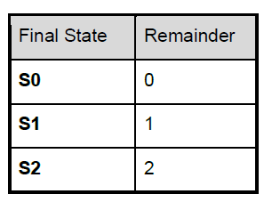

# Mod three with Finite State Machines
Find mod three of a binary integer using Finite State Machine approach

### Finite State Machines (FSM) explained


### Solving Mod three problem with FSM

Let us solve this mod-three problem by a generic FSM. It takes the input characters, one at a time, MOST significant bit first and transitions between three states: S0, S1, S2.


The value returned from our function will depend on the state selected after the character sequence is exhausted. The final state will be converted to a remainder value as specified in the following table:




For input string ”110”, the machine will operate as follows:

1. Initial state = S0, Input = 1, result state = S1.
2. Current state = S1, Input = 1, result state = S0.
3. Current state = S0, Input = 0, result state = S0.
4. No more input – return the remainder value corresponding to the final state S0.

For input string ”1010” the machine will operate as follows:
1. Initial state = S0, Input = 1, result state = S1.
2. Current state = S1, Input = 0, result state = S2.
3. Current state = S2, Input = 1, result state = S2.
4. Current state = S2, Input = 0, result state = S1.
5. No more input - return the remainder value corresponding to the final state S1.

### Requirements
- Python 3 and above is required for this project.
- Ensure bash application is installed on your machine/terminal.

> This project doesnt require any python modules to be installed explicitly. Hence `requirements.txt` file is empty.

### Running the code


```
# clone repo
git clone https://github.com/pavankosaraju/fsm-modthree.git

# change directory
cd fsm-modthree

# run the script
./run.sh <binary integer OR path to text file containing binary integers>

# Examples
./run.sh 1111

./run.sh ./tests/testcases.txt
```


### Test code

```
python -m unittest -v
```

